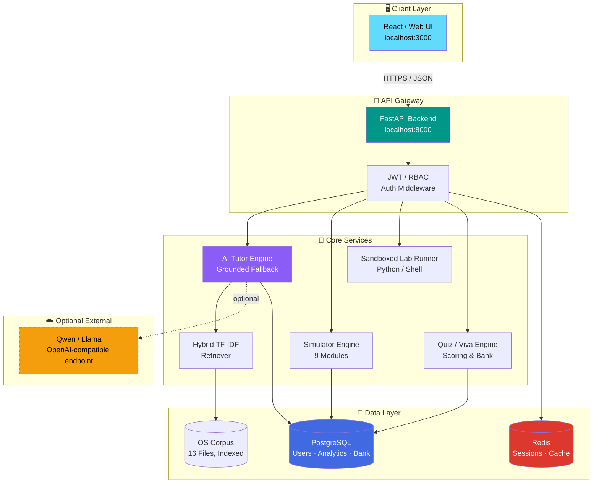
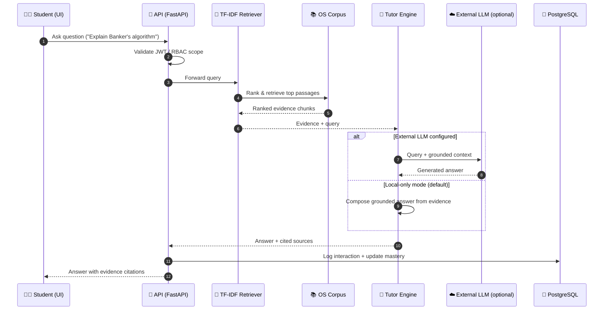
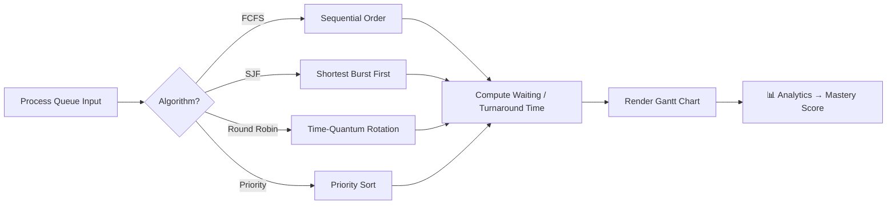
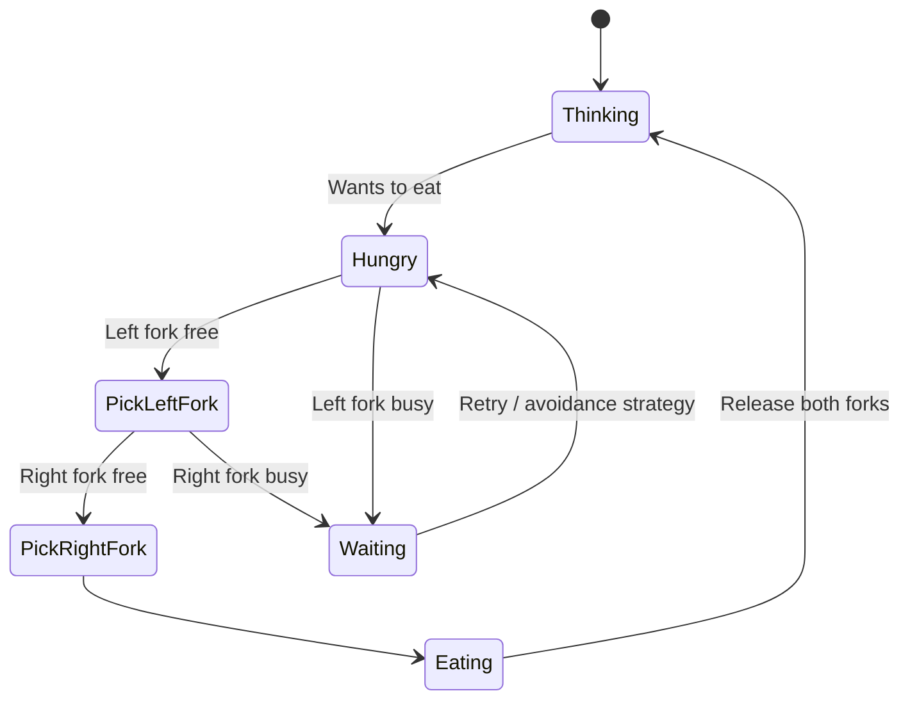
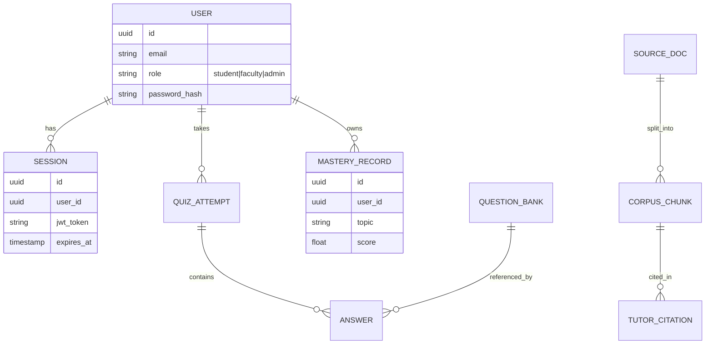
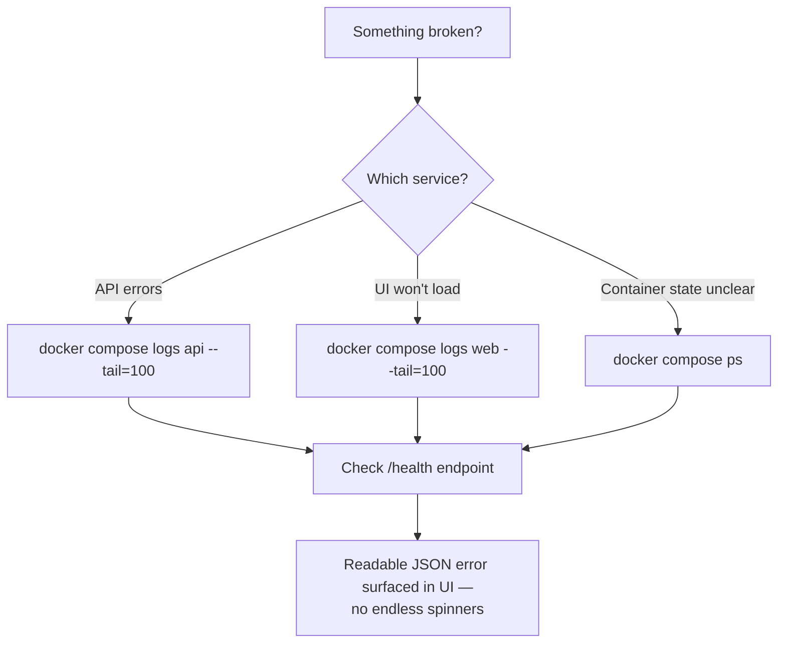

```
 ██████╗ ███████╗████████╗██╗   ██╗████████╗ ██████╗ ██████╗ ██╗     ██╗     ███╗   ███╗
██╔═══██╗██╔════╝╚══██╔══╝██║   ██║╚══██╔══╝██╔═══██╗██╔══██╗██║     ██║     ████╗ ████║
██║   ██║███████╗   ██║   ██║   ██║   ██║   ██║   ██║██████╔╝██║     ██║     ██╔████╔██║
██║   ██║╚════██║   ██║   ██║   ██║   ██║   ██║   ██║██╔══██╗██║     ██║     ██║╚██╔╝██║
╚██████╔╝███████║   ██║   ╚██████╔╝   ██║   ╚██████╔╝██║  ██║███████╗███████╗██║ ╚═╝ ██║
 ╚═════╝ ╚══════╝   ╚═╝    ╚═════╝    ╚═╝    ╚═════╝ ╚═╝  ╚═╝╚══════╝╚══════╝╚═╝     ╚═╝

     ██████╗ ███████╗    ██╗      █████╗ ██████╗ 
    ██╔═══██╗██╔════╝    ██║     ██╔══██╗██╔══██╗
    ██║   ██║███████╗    ██║     ███████║██████╔╝
    ██║   ██║╚════██║    ██║     ██╔══██║██╔══██╗
    ╚██████╔╝███████║    ███████╗██║  ██║██████╔╝
     ╚═════╝ ╚══════╝    ╚══════╝╚═╝  ╚═╝╚═════╝ 

           L O C A L - F I R S T   O P E R A T I N G   S Y S T E M S   A I   L A B
```

<div align="center">

# 🖥️ OSTutorLLM 3.0

### Local-First Operating Systems AI Lab

**Zero-config, offline-capable Operating Systems tutor, simulator suite, and lab environment — dockerized end-to-end.**

[](https://www.docker.com/)
[](https://fastapi.tiangolo.com/)
[](https://www.postgresql.org/)
[](https://redis.io/)
[](https://jwt.io/)
[](#-license)
[](#-troubleshooting)
[](#-contributing)

**No API key. No manual setup. One command, one browser tab, fully working OS course lab.**

[Quick Start](#-zero-config-launch) · [Features](#-included) · [Simulators](#-simulator-suite) · [Architecture](#-architecture) · [API Docs](#-api-reference) · [Accounts](#-evaluation-accounts)

</div>

---

## 📖 Table of Contents

- [Overview](#-overview)
- [Zero-Config Launch](#-zero-config-launch)
- [Evaluation Accounts](#-evaluation-accounts)
- [What's Included](#-included)
- [Architecture](#-architecture)
- [Request Flow — AI Tutor](#-request-flow--ai-tutor)
- [Simulator Suite](#-simulator-suite)
- [Data & Auth Model](#-data--auth-model)
- [Project Structure](#-project-structure)
- [Optional External LLM](#-optional-external-llm)
- [Operations](#-operations)
- [Troubleshooting](#-troubleshooting)
- [Roadmap](#-roadmap)
- [Contributing](#-contributing)
- [License](#-license)

---

## 🧭 Overview

**OSTutorLLM** packages a full-semester Operating Systems lab into a single `docker compose up`. It ships with:

- A **grounded AI tutor** that cites the exact source passage it answered from — no hallucinated theory.
- **9+ interactive simulators** covering scheduling, memory, concurrency, and deadlock.
- A **question bank + viva engine** with persistent mastery tracking per student.
- **Sandboxed Python & shell labs** for hands-on systems programming.
- **Faculty/Admin tooling** for corpus management, analytics, and RBAC.

It works **completely offline** by default — the bundled 16-file OS corpus and local retrieval engine mean no external LLM key is required to get full functionality.

---

## ⚡ Zero-Config Launch

```powershell
# 1. Install Docker Desktop
# 2. Extract this folder
# 3. From the project root:
docker compose up --build
```

| Service        | URL                              |
|----------------|-----------------------------------|
| 🌐 Web App      | http://localhost:3000            |
| 📘 API Docs      | http://localhost:8000/docs       |
| ❤️ Health Check  | http://localhost:8000/health     |

> No source upload required — the bundled **16-file OS corpus** is indexed automatically on first boot.
> No external LLM key required — the **local grounded tutor** and bundled assessment flow work out of the box.
> An OpenAI-compatible **Qwen/Llama** endpoint can be plugged in later via environment variables.

---

## 🔑 Evaluation Accounts

| Role     | Email                        | Password       |
|----------|-------------------------------|----------------|
| 🎓 Student | `student@ostutor.local`      | `Student123!`  |
| 🧑‍🏫 Faculty | `faculty@ostutor.local`      | `Faculty123!`  |
| 🛠️ Admin   | `admin@ostutor.local`        | `Admin123!`    |

---

## 📦 Included

<table>
<tr><td width="50%" valign="top">

**AI & Retrieval**
- AI Tutor with evidence citations
- Hybrid TF‑IDF retrieval engine
- Bundled OS source corpus (16 files)
- PDF / PPTX / DOCX / TXT / MD ingestion

**Assessment**
- Quiz & viva question bank
- Automated scoring
- Persistent mastery analytics

</td><td width="50%" valign="top">

**Simulators**
- CPU scheduling (FCFS, SJF, RR, Priority)
- Page replacement (FIFO, LRU, Optimal)
- Banker's algorithm / deadlock detection
- Disk scheduling (FCFS, SCAN, C-SCAN, SSTF)
- Paging & segmentation
- Producer–consumer
- Dining philosophers
- Thread lifecycle

**Labs & Ops**
- Restricted Python & shell labs
- Faculty/admin source management
- JWT / RBAC auth
- PostgreSQL + Redis
- Docker healthchecks
- Responsive web UI

</td></tr>
</table>

---

## 🏗️ Architecture



---

## 🔄 Request Flow — AI Tutor



---

## 🧩 Simulator Suite

<div align="center">

| Simulator | Algorithms | Visualizes |
|---|---|---|
| 🕒 **CPU Scheduling** | FCFS · SJF · Round Robin · Priority | Gantt chart, waiting/turnaround time |
| 📄 **Page Replacement** | FIFO · LRU · Optimal | Frame table, page faults |
| 🏦 **Banker's / Deadlock** | Safety algorithm, resource graphs | Safe sequence, deadlock cycles |
| 💽 **Disk Scheduling** | FCFS · SCAN · C‑SCAN · SSTF | Seek path, total head movement |
| 🧱 **Paging & Segmentation** | Address translation | Logical → physical mapping |
| 🏭 **Producer–Consumer** | Bounded buffer, semaphores | Buffer state over time |
| 🍝 **Dining Philosophers** | Deadlock-avoidance strategies | Fork contention, wait states |
| 🧵 **Thread Lifecycle** | State machine | New → Ready → Running → Blocked → Terminated |

</div>

#### Example — CPU Scheduling Engine Flow



#### Example — Dining Philosophers Deadlock Flow



---

## 🔐 Data & Auth Model



**RBAC scopes:**

| Role | Tutor | Simulators | Labs | Quiz/Viva | Source Mgmt | Analytics |
|---|:---:|:---:|:---:|:---:|:---:|:---:|
| Student | ✅ | ✅ | ✅ | ✅ | ❌ | Own only |
| Faculty | ✅ | ✅ | ✅ | ✅ manage | ✅ | Cohort |
| Admin | ✅ | ✅ | ✅ | ✅ | ✅ | Global |

---

## 🗂️ Project Structure

```
OSTutorLLM/
├── backend/              # FastAPI app, tutor engine, simulators, auth
├── frontend/             # Responsive web UI
├── docs/                 # OS corpus, docs, question bank sources
├── scripts/              # Setup / maintenance scripts
├── .github/workflows/    # CI pipelines
├── docker-compose.yml    # Full stack orchestration
├── .env.example          # Environment variable template
├── RUN.bat               # One-click Windows launcher
├── TEST-ALL.bat          # Full test suite runner
└── README.md
```

---

## ☁️ Optional External LLM

Want smarter, generative answers on top of the grounded evidence? Point OSTutorLLM at any OpenAI-compatible endpoint (Qwen, Llama, etc.):

```env
# .env
LLM_BASE_URL=https://your-endpoint/v1
LLM_API_KEY=sk-xxxxxxxxxxxxxxxx
LLM_MODEL=qwen2.5-14b-instruct
```

The app **continues to work fully offline** if these are left unset — the local grounded tutor is the default, not a fallback bolted on afterward.

---

## 🛠️ Operations

**Restart everything (rebuild):**
```powershell
docker compose up -d --build
```

**Stop everything:**
```powershell
docker compose down
```

**Reset volumes (⚠️ wipes DB):**
```powershell
docker compose down -v
```

---

## 🚑 Troubleshooting



| Symptom | Command | Notes |
|---|---|---|
| API not responding | `docker compose logs api --tail=100` | Check DB connection first |
| Blank / stuck UI | `docker compose logs web --tail=100` | Verify `localhost:8000/health` |
| Containers won't start | `docker compose ps` | Look for `unhealthy` status |
| Full reset | `docker compose down -v && docker compose up --build` | Wipes and reseeds corpus + DB |

The API always returns **readable JSON error details**, and the UI surfaces them directly — you're never left staring at an infinite loading state.

---

## 🗺️ Roadmap

- [ ] Additional simulators (memory-mapped files, RAID scheduling)
- [ ] Multi-language corpus support
- [ ] Faculty-side analytics dashboard v2
- [ ] Offline LLM quantized model bundling
- [ ] Mobile-responsive lab terminal

---

## 🤝 Contributing

Contributions, issues, and feature requests are welcome!

1. Fork the repo
2. Create a feature branch (`git checkout -b feature/amazing-thing`)
3. Commit your changes
4. Open a Pull Request

---

## 📄 License

Distributed under the **MIT License**. See `LICENSE` for details.

<div align="center">

**Built for Operating Systems students, by people who've debugged one too many deadlocks.**

⭐ Star this repo if OSTutorLLM helped you survive your OS course.

</div>
